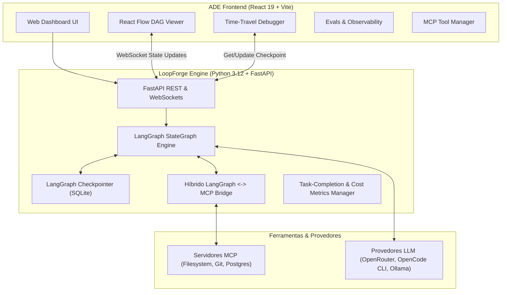
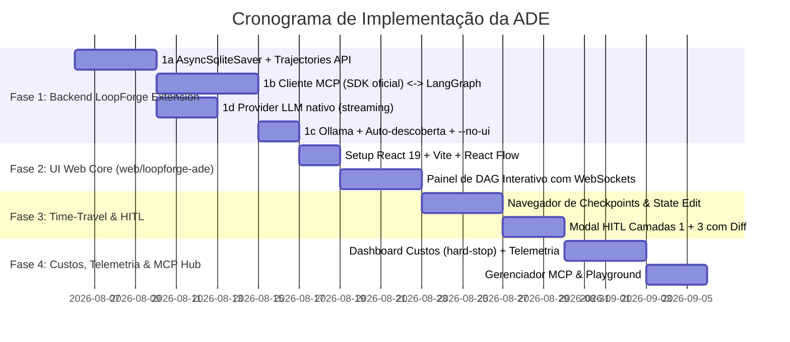

# 🛠️ Plano Mestre de Arquitetura: ADE (Agentic Development Environment)

Este documento estabelece a arquitetura, o roteiro técnico e as especificações de design para a criação de uma **ADE (Agentic Development Environment)** de nível industrial. A solução aproveita o motor autônomo [LoopForge](../../agentes/LoopForge/README.md) como backend de orquestração e constrói uma interface moderna em **React 19 + Vite + React Flow**.

> [!IMPORTANT]
> **v5 — v2 auditou o código real do LoopForge e o mercado; v3 travou as decisões de produto do grill (seção 4.1); v4 travou as decisões de UX/UI do grill (seção 4.2); v5 trava as decisões de engenharia & operação do grill técnico (seção 4.3).**
> As premissas do v1 foram validadas contra o código (seção 3): o que o LoopForge já entrega, o que falta implementar e quais afirmações eram imprecisas. A seção 4 registra as diretrizes estratégicas de posicionamento + as decisões travadas. A seção 5 separa os recursos em **Tier 1 (V1/MVP)** e **Tier 2 (V2+/backlog)** — **nenhuma feature foi removida**, apenas priorizada: as de Tier 2 serão implementadas posteriormente.

---

## 📐 1. Visão Geral do Ecossistema

O objetivo da ADE é transformar a orquestração agêntica de um mero "script de terminal" em uma **plataforma visual de depuração, simulação e governança** em tempo real.

---

## ⚡ 2. Arquitetura Técnica & Decisões Refinadas

| Camada | Tecnologia / Escolha | Papel na ADE | Status vs código atual |
|---|---|---|---|
| **Localização do Frontend** | `web/loopforge-ade` | Aplicação React 19 + Vite em pasta dedicada em `web/`. **Backend da ADE embutido no LoopForge (`src/lf`), release conjunto (E1)** — um pacote, uma versão. | — |
| **Backend Core** | Python 3.12 + FastAPI + Uvicorn | API REST, streaming WebSockets e controle do ciclo de vida dos agentes no LoopForge. | ✅ Já existe (`src/lf/api/app.py`, `create_app()`, via `lf serve`) |
| **Integração CLI <-> Web UI** | `lf serve` embutido com SPA | O comando `lf serve` inicia a API e serve a SPA estática do React, abrindo o navegador. | ⚠️ Hoje serve dashboard HTML embutido; flag `--no-ui` e servir SPA React são trabalho da Fase 2 |
| **Protocolo Real-Time** | WebSockets Bidirecionais + Fallback SSE, **com replay/backfill ao conectar (E4)** | Streaming de eventos dos nós, logs em tempo real e canal de sinalização HITL. Ao conectar (ou reconectar), a UI recebe **estado completo da run + eventos desde o início** — essencial para runs via CLI (UX17) aparecerem ao vivo. | ✅ `/ws/streaming` + `/ws/runs/{id}` já existem (eventos `node_execution`, `human_decision_submitted`, ...); **backfill é novo (Fase 2)** |
| **Token Streaming** | Streaming token a token (provider nativo, Fase 1d) — **consumo sóbrio por evento (UX4)** | O canvas muda cor/status/borda por evento, **sem tokens ao vivo no nó**; o streaming real alimenta os logs estruturados do console. | ⚠️ **Decisão v3**: provider LLM nativo em Python (HTTP streaming) como caminho principal (Fase 1d); OpenCode CLI vira fallback. Hoje o runtime é subprocess — sem streaming token a token |
| **Design System & Estética** | **Sóbrio (Vercel/Linear) + acentos por tipo de nó (UX19)**; dark-first (UX18); a11y básica: contraste AA + teclado nas ações principais (UX20) | Base visual da UI já no V1 — o glassmorphism neon do v1 foi descartado no grill (baixo contraste para payloads/logs densos). **UI em inglês (E8)**; **dark é o único tema no V1 (E15)**. | Fase 2 |
| **Temas & Customização** | Presets (Cyberpunk, Nord, GitHub Dark) + tema claro | Temas visuais selecionáveis com editor de acentos. **Só dark no V1 (E15)**; presets + tema claro entram com o Tier 2 (UX18). | V2 (Tier 2) |
| **Layout da UI** | 3 Colunas Redimensionáveis + **fullscreen do canvas (F11, UX14)**; **split canvas + console (UX1)** | Sidebar de Threads/Navegação \| Centro (canvas, kanban linear) \| Direita (Inspeção) + console fixo abaixo do canvas (**logs filtráveis por nó, nível e busca — E6**). Estado da UI **só na sessão** (UX15). | Fase 2 |
| **Command Palette & Atalhos** | Command Palette Global (Ctrl+K) | Menu rápido de busca por comandos, nós, troca de threads, ações HITL e atalhos. | V2 (Tier 2) |
| **Engine de Agentes** | LangGraph (`StateGraph`) | Gerenciamento determinístico de grafos de estado, fluxos de reflexão e HITL. | ✅ **9 nós reais**: cpo, pm, tech_lead, test_writer, developer, qa, appsec, devops, parallel_audit |
| **Grafos Dinâmicos** | Spawning de Nós em Tempo Real | Renderização dinâmica no React Flow conforme novos subagentes/nós são criados. | Fase 2 |
| **Comparador A/B** | Split-Screen Graph Execution | Rodar a mesma tarefa com modelos/prompts diferentes e comparar métricas. | V2 (Tier 2); base: `--mock` já existe |
| **Modo Dry-Run / Mock** | Respostas Sintéticas Pré-Gravadas | Simulação com custo zero de tokens para teste de fluxo e validação de DAGs. | ✅ Já existe (`--mock`, `MockLLMProvider`, mocks por nó) |
| **Ponte Híbrida MCP** | **SDK oficial `mcp` (Python) — decisão v3** + bridge em `loopforge/mcp/` | SDK cuida do transporte/protocolo; a ADE foca na conversão de schemas em Pydantic Tool Definitions para o LangGraph + permissões deny-by-default. Servidores MCP declarados no `.loopforge/ade.yaml` (E9). | ❌ **Zero código MCP hoje** — Fase 1b (maior risco) |
| **Navegação Web Embarcada** | Playwright Headless + Screen Stream | Chromium embarcado com streaming visual ao vivo para o Dashboard. | V2 (Tier 2) — candidato a revisão de escopo |
| **Resiliência de LLMs** | Fallback: **Provider Nativo (HTTP)** → OpenCode CLI → Mock | Troca de provedor em caso de falhas/rate limits com alertas na UI. | ✅ **Decisão v3**: provider nativo Python vira primário (Fase 1d); hoje a matriz real é OpenRouter (HTTP) → OpenCode (subprocess) → Mock. **Gemini e Ollama não têm clientes**; Ollama entra na Fase 1c, Gemini fica apenas como string de config |
| **Air-Gapped & LLMs Locais** | Auto-descoberta Ollama/vLLM + Toggle Privacy | Auto-detecção via `/api/tags` com modo "Air-Gapped Privacy" de 1-clique. | ❌ Não existe — Fase 1c (back-end); toggle na UI é V2 |
| **Central de Prompts** | Central na UI + Versionamento YAML | Versionamento semântico de prompts com visualizador de diff e rollback. | V2 (Tier 2) |
| **Gestão de Memória & Lições** | Painel "Memory & Learnings" | Busca, edição e injeção de lições do `lessons.md`/SQLite nos contextos. | ✅ Back-end existe (`MemoryManager`, tabela `lessons`); UI é V2 |
| **Integração Git Integrada** | Painel Git + Diff Visual + `lf pr` | Commit visual, diffs de código gerado e acionamento da GitHub CLI. | ✅ Back-end existe (`lf pr`, `lf diff`); UI é V2 |
| **Monitor de Saúde Host** | Widget "System Health" | CPU, RAM, contagem de processos sandbox e status dos WebSockets. | V2 (Tier 2) |
| **Diagnóstico de Falhas** | Diagnostic & Error Tracer | Visualizador de exceções com stack traces Python/JS e exportação. | V2 (Tier 2) |
| **Sandbox de Ferramentas** | Híbrido (Local Dev / Docker Efêmero) | Execução direta no filesystem com opção de isolamento em container. | ⚠️ `runner/sandbox.py` existe (cobertura 45%); consolidar na Fase 1 |
| **Persistência de Trajetória** | SQLite Assíncrono (`.loopforge/trajectories.db`) | Checkpoints + export/import de trajetórias em JSON. **Sem limpeza/prune automática no V1 (E11)** — dev solo + localhost; TTL configurável fica no V2. | ⚠️ Hoje existe `SqliteSaver` **síncrono** em `.loopforge/checkpoints.sqlite`; migração para `AsyncSqliteSaver` + rotas é a Fase 1a |
| **Otimização LLM & Cache** | Cache SQLite + Resumo de Contexto | Evita chamadas LLM duplicadas e comprime histórico perto do limite de tokens. | ✅ `SQLiteLLMCache` (hash SHA256 + normalização) + `compress_prompt()` existem; cache vetorial (embeddings) é V2 |
| **Exportação & Relatórios** | Pacote ZIP (Markdown + JSON) | Exportação de artefatos, logs, trajetórias e métricas. | ⚠️ `lf export` existe; ampliar para relatório ADE na Fase 4 |
| **Alertas & Notificações** | OS Desktop Notify + Webhooks | `notify-send` + webhooks Discord/Slack/Telegram. | ✅ Back-end existe; UI de configuração é V2 |
| **Autenticação & RBAC** | Local por padrão + JWT/API Keys | Acesso local sem senha; JWT/API Keys para times. | ⚠️ **Decisão v3**: público-alvo V1 = **dev solo** → RBAC/JWT para times fica em V2. X-API-Key simples já existe (`auth.py`) |
| **Segurança do Localhost** | **Binding 127.0.0.1 + CORS restrito (E5)** | O dashboard executa código local com acesso a arquivos/LLMs: binding local por padrão; CORS liberado apenas para a origem da SPA (dev: localhost do Vite; prod: same-origin). | Fase 2 (hardening junto da integração SPA) |
| **Workspace Multi-Thread** | **Abas no topo (UX11); 1 run ativa + fila no V1 (E3)** | Uma run visível por vez com indicador de status na aba; forks derivados aparecem como abas ligadas à origem. Execução paralela **real** (com atomic task checkout) fica para o V2 — V1 enfileira. | Fase 2 (UI) + **atomic task checkout** no back-end (V2) |
| **Extensibilidade & Plugins** | System Hooks & Event Listeners | Hooks Python/JS para custom node types, métricas e conectores. | V2 (Tier 2) |
| **Empacotamento & Distribuição** | **CLI + localhost web (decisão v3); MIT (E12); release conjunto (E1)** | `pip install loopforge-ade` — pacote que **embute a SPA compilada** e **depende de `lf`** (um release só); `lf serve` abre o dashboard. Docker/GHCR vira opcional, não obrigatório. | ⚠️ LoopForge já é v6.0.0 no PyPI; empacotar a ADE é Fase 4 |
| **Garantia de Qualidade (QA)** | Playwright (E2E) + Pytest (Backend) | E2E para a UI + Pytest com mocks de LLM. **V1: smoke E2E (load, DAG renderiza, navegação) + unit tests dos componentes críticos (E13)**; E2E completo fica para o V2. | ✅ Back-end: 217 testes, 77% cobertura; Playwright E2E é novo (Fase 2+) |
| **Experiência HITL** | **Painel não-modal (drawer lateral, UX8)** com diff Code/Prompt | O nó pausado fica visível no canvas enquanto o usuário decide; "Adjust State" via form guiado + avançado JSON (UX9); timeout configurável + notificação OS (UX10). | ✅ Interrupt/HITL existe; UI do drawer é Fase 3 |
| **Visualizador de Grafos** | `@xyflow/react` (React Flow v12) | DAGs agênticos interativos com nós customizados, animação e zoom/pan. | Fase 2 |
| **Gerenciamento de Estado** | Zustand com Undo/Redo (Ctrl+Z) + TanStack Query | Estado reativo com histórico Undo/Redo e sincronização WebSocket. | Fase 2 |

---

## 🧭 3. Validação contra o LoopForge Real (auditoria de premissas)

### 3.1 Premissas confirmadas (base real pronta)

| Premissa do v1 | Realidade (código) |
|---|---|
| 9 nós LangGraph StateGraph | ✅ `NodeRegistry` em `pipeline/graph.py:85-95` — cpo, pm, tech_lead, **test_writer**, developer, qa, appsec, devops, parallel_audit |
| FastAPI + WebSockets | ✅ REST CRUD + `/ws/streaming` + `/ws/runs/{id}`; SQLAlchemy async + aiosqlite em `.loopforge/telemetry.sqlite` |
| HITL | ✅ `interrupt_after` + rotas `/api/runs/{id}/decide` e `/decisions` |
| Mock / dry-run | ✅ `--mock`, `MockLLMProvider`, mocks sintéticos por nó |
| Benchmark ELO | ✅ `lf benchmark` (default `--mock`) |
| Cache SQLite + compressão de prompt | ✅ `SQLiteLLMCache` + `compress_prompt()` |
| Memória / lessons | ✅ `MemoryManager` (tabela `lessons`) + `lessons.md` |
| CLI completa | ✅ 16 comandos Click: `run, serve, benchmark, resume, diff, explore, pr, export, studio, init, plan, status, release, completion, generate-tests, audit` |
| QA | ✅ 217 testes passando, 77% de cobertura (limiar CI: 75%) |

### 3.2 Premissas falsas / gaps (trabalho futuro)

| Item do v1 | Realidade | Onde entra |
|---|---|---|
| Cliente MCP nativo | ❌ **Zero ocorrências de MCP** no repo (`src/`, `docs/`, testes) | Fase 1b (maior risco de estimativa) |
| `.loopforge/trajectories.db` + `AsyncSqliteSaver` | ❌ Não existe; hoje `SqliteSaver` **síncrono** em `checkpoints.sqlite` | Fase 1a |
| Rotas `/api/v1/trajectories/*` (checkpoints/export/import) | ❌ Não existem | Fase 1a |
| Fallback "Gemini → OpenRouter → Ollama" | ❌ Matriz real: **OpenRouter (HTTP) → OpenCode (subprocess) → Mock**; Gemini/Ollama não têm clientes | Fase 1c (Ollama); Gemini removido da matriz |
| Auto-descoberta Ollama/vLLM via `/api/tags` | ❌ Não existe | Fase 1c |
| `lf serve --no-ui` + SPA React | ❌ Flag não existe; `lf serve` entrega dashboard HTML embutido | Fase 2 |

### 3.3 Imprecisões factuais corrigidas

- O 9º nó do grafo é **`test_writer`** (gera testes-contrato), **não** "Lessons". `lessons` é a função `generate_lessons_md()`, invocada **dentro** do nó `parallel_audit`.
- `README.md` do LoopForge diz "31 arquivos de teste" — na prática são **52** (e o AGENTS.md diz 32). Documentação desatualizada.
- O `README.md` lista "Lessons" como nó — imprecisão que também deve ser corrigida no LoopForge.

---

## 🎯 4. Diretrizes Estratégicas (posicionamento)

> **Posicionamento: "LangGraph Studio para pipelines de software, com governança de Paperclip."**
>
> Nenhum concorrente cobre os 5 pilares juntos (**DAG visual + time-travel + HITL + MCP manager + evals**):
> Paperclip recusa DAG visual de propósito; Orca é camada de ambiente sem debugger; LangGraph Studio não tem evals/governança; Mastra Studio não tem time-travel por checkpoint. **Esse é o espaço vago da ADE.**

1. **Custo com enforcement, não só relatório** — orçamento por run/thread com **hard-stop** (auto-pause a 100%, warning a 80%) + **atomic task checkout** (sem lock, execuções paralelas fazem double-work). Base: `CostTracker` já existe; estender com enforcement. *(Referência: Paperclip.)*
2. **Evals por task-completion, não só ELO por votos** — métricas de sessão real: *confirmed success, steerability, bash recovery, tool hallucination* (padrão Agent Arena 2026) + datasets versionados + experiments lado a lado (padrão Mastra). ELO vira métrica secundária. **Decisão v3: evals amadurecem no V2** — o V1 entrega só a telemetria que os alimenta. *(Referência: Arena AI, Mastra Studio.)*
3. **HITL em 3 camadas** — (1) interrupt técnico [✅ existe]; (2) **approval gates de trabalho** (aprovar unidade de trabalho completa, não só tool call) — **prioridade V2 (público time, decisão v3)**; (3) **override com rollback** (ancorado no fork de checkpoint). *(Referência: Paperclip.)*
4. **Contexto como recurso gerenciado** — monitor de tokens/contexto por nó com thresholds, snapshot/recovery e sharding de instruções. Base: cache + compressão existem; falta a telemetria visível na UI. *(Referência: AIOSON.)*
5. **Worktree = unidade de paralelismo** — quando o multi-thread sair do papel, cada lane vira um worktree git isolado. Base: `runner/git/` já tem checkpoint/pr/sandbox. *(Referência: Orca, ADE.)*
6. **ADE dirigível por agentes** — o dashboard deve ser orquestrável via CLI (`lf ade ...`), não só via UI. *(Referência: `orca worktree create`.)*
7. **BYOA (Bring Your Own Agent)** — integrar CLIs de agentes existentes via contrato (OpenCode já é o runtime do LoopForge); não construir agentes proprietários. *(Referência: Orca, Paperclip, ADE.)*

### 4.1 Decisões travadas (grill 2026-08-05)

| # | Decisão | Impacto no plano |
|---|---|---|
| D1 | **Distribuição: CLI + localhost web** (`pip install` + `lf serve` abre o dashboard) | Docker/GHCR vira opcional (V2); empacotamento simples na Fase 4 |
| D2 | **Público-alvo V1: dev solo** | RBAC/JWT, approval gates e governança de time → V2 |
| D3 | **Runtime LLM: provider nativo Python (HTTP streaming) + OpenCode CLI como fallback** | Novo item 1d na Fase 1; habilita token streaming (Fase 2) e base do time-travel (Fase 3) |
| D4 | **Time-travel V1: só estado do grafo** (sem rollback de filesystem) | Fork de checkpoint edita prompts/variáveis; side-effects reexecutam por cima; escopo honesto e enxuto |
| D5 | **MCP: SDK oficial `mcp` (Python)** para transporte; ADE foca na bridge + deny-by-default | Reduz custo de manutenção da spec em evolução |
| D6 | **Evals: telemetria no V1, evals (task-completion/datasets/experiments) no V2** | Feature 4 do MVP vira "Custos + Telemetria"; evals entram no backlog |
| D7 | **Prazo-alvo do V1: 4-6 semanas** | Gantt soma ~31 dias úteis → Fase 4 inicia em paralelo com o fim da Fase 3 ou escopo fecha em Custos+Telemetria |

### 4.2 Decisões de UX/UI travadas (grill UX 2026-08-05)

20 decisões do grill de UX/UI. A tabela de arquitetura (seção 2) e as features (seção 5) já refletem estas decisões.

| # | Decisão de UX/UI | Impacto na UI |
|---|---|---|
| UX1 | **Metáfora central: split canvas + console** | Canvas (grafo) em cima, console fixo de logs/telemetria embaixo — hierarquia: execução + evidência |
| UX2 | **Layout do grafo: kanban linear + modo grafo** | Fluxo quase linear (entry→cpo→...→qa→retry→parallel_audit) renderiza como colunas por nó; toggle "modo grafo" 2D para loops de retry/fork |
| UX3 | **Parallel Audit: card único expandível** | AppSec + DevOps ficam colapsados; revelam ao clicar (detail-on-demand) |
| UX4 | **Streaming: sóbrio por evento** | Nós mudam cor/status/borda por evento; **sem tokens ao vivo no canvas** — o streaming real alimenta logs estruturados no console |
| UX5 | **Time-travel: futuro ghosted** | Nós/arestas do futuro esmaecidos — trajetória visível sem confundir com o presente |
| UX6 | **Banner fixo de modo inspeção** | "Inspeção — step X/Y — [Resumir daqui] [Voltar ao vivo]" — impossível achar que está ao vivo |
| UX7 | **Fork = nova thread derivada** | Editar estado e resumir cria run ligada à origem; histórico auditável; abas mostram a derivação |
| UX8 | **HITL: painel não-modal** | Drawer lateral; nó pausado segue visível no canvas enquanto decide |
| UX9 | **Adjust State: form + avançado** | Form guiado por campo (diff do estado) + botão "avançado" para JSON com schema validation |
| UX10 | **Timeout HITL: configurável + notificação** | Timeout (ex.: 10min) → notificação OS + badge; run pausada marcada "esperando" |
| UX11 | **Runs paralelas: abas no topo** | Uma run visível por vez, status na aba; forks como abas ligadas à origem |
| UX12 | **Custos: chip por nó + barra global** | Custo vira parte da leitura do grafo; barra de orçamento sempre visível |
| UX13 | **Hard-stop: toast 80% + modal 100%** | Warning a 80%; modal bloqueante a 100% com opção "dar override" (enforcement com escape consciente) |
| UX14 | **Layout: 3 colunas + fullscreen (F11)** | 3 colunas redimensionáveis por padrão; canvas vira fullscreen com 1 atalho |
| UX15 | **Persistência da UI: só na sessão** | Resize/aba/zoom não persistem entre sessões no V1 (menos código, menos surpresa) |
| UX16 | **Onboarding: demo mock 1-clique** | Empty state com "Rodar demo (mock)" disparando run sintética dos 9 nós (custo zero) |
| UX17 | **Runs via CLI: auto-aparecem ao vivo** | `lf run` no terminal aparece no dashboard ao vivo (mesmo backend, diretriz 7) |
| UX18 | **Tema: dark-first, light depois** | Só dark no V1; tema claro fica no Tier 2 junto dos presets |
| UX19 | **Estética: sóbrio + acentos por nó** | Base Vercel/Linear (leitura de logs/payloads densos) + cor por tipo de nó (CPO, Dev, QA...); **glassmorphism neon do v1 descartado** |
| UX20 | **A11y: básico** | Contraste AA + navegação por teclado nas ações principais (HITL, slider, abas) |

### 4.3 Decisões de Engenharia & Operação travadas (grill técnico 2026-08-05)

| # | Decisão | Impacto no plano |
|---|---|---|
| E1 | **Backend da ADE embutido no LoopForge** (`src/lf`); SPA em `web/loopforge-ade`; `loopforge-ade` = pacote pip que embute a SPA e depende de `lf` | Um repo, uma versão, release conjunto — sem versionamento cruzado de pacotes |
| E2 | **Run é a unidade primária da UI** (API `/api/runs`); thread/checkpoint é detalhe interno do time-travel | Abas = runs; "resumir" = retomar a run; threads aparecem só no time-travel |
| E3 | **Multi-thread no V1: 1 run ativa + fila**; execução paralela real com atomic checkout no V2 | Evita contenção de escrita/checkpoint no prazo; abas mostram fila + status |
| E4 | **WS com replay/backfill ao conectar**: estado completo + eventos desde o início da run | Run iniciada via CLI (UX17) ou antes da UI abrir aparece completa na tela |
| E5 | **Segurança local: binding 127.0.0.1 + CORS restrito à origem da SPA** | Dashboard local não exposto na rede; dev via localhost do Vite, prod same-origin |
| E6 | **Console fixo com logs filtráveis** — filtro por nó, nível (info/warn/error) e busca | Define o protocolo de eventos: streaming (UX4) emite logs estruturados por nó |
| E7 | **Retries visíveis no canvas**: badge de contagem no card + lista de tentativas no drawer | Loop `should_retry` (developer↔qa) vira leitura do grafo; **doom-loop detection (abortar após N retries sem progresso) no V2** |
| E8 | **Idioma da UI: inglês** (conteúdo gerado e docs seguem o repo em PT) | Strings em EN desde o V1; i18n não entra no prazo |
| E9 | **Config central `.loopforge/ade.yaml`** (orçamento, MCP servers, providers, timeout HITL) + override pela UI | Reusa o config loader JSON/YAML já existente no LoopForge; versionável pelo usuário |
| E10 | **Telemetria mínima com schema estável desde o V1**: decisões HITL, retries, latência por nó, tokens/custo, erros de tool | Vira o dataset bruto dos evals do V2 (D6) — quanto antes gravar, melhor o histórico |
| E11 | **Sem prune do `trajectories.db` no V1** (dev solo + localhost) | TTL/limite configurável fica no V2; export/import é o backup manual |
| E12 | **Licença: MIT** (checar coerência com a licença do LoopForge) | Alinhada a Orca/Paperclip/OpenClaw; não trava contribuições |
| E13 | **QA do frontend no V1: smoke E2E (load, DAG renderiza, navegação) + unit tests dos componentes críticos** | E2E completo (HITL/time-travel) fica para o V2 |
| E14 | **Backend offline: banner "servidor desconectado" + reconexão automática + última view preservada** | UX de falha do processo dono do estado; sem cache offline (pesado demais p/ V1) |
| E15 | **Dark é o único tema no V1** | Light + presets entram no Tier 2 (UX18) — menos superfície de teste de contraste |

---

## 🌟 5. Recursos da ADE

> Todas as features do v1 foram **mantidas**, separadas em dois tiers de prioridade. Tier 2 não é "descartado" — é **backlog programado para depois da entrega do MVP**.

### Tier 1 — V1 (MVP)

#### 1. Visualizador Dinâmico de DAG & Estado dos Nós
* **Renderização Interativa (UX2)**: **kanban linear** por padrão (colunas por nó: entry, CPO, PM, Tech Lead, Test Writer, Dev, QA, Retry, Parallel Audit) + toggle "modo grafo" 2D completo para os loops de retry/fork.
* **Status em Tempo Real (UX4)** via WebSocket: Pendente, Em Execução, Aprovado, Rejeitado, Pausado para HITL — mudança de cor/status/borda por evento (sóbrio, sem tokens ao vivo).
* **Parallel Audit (UX3)**: card único expandível que revela appsec + devops ao clicar (detail-on-demand).
* **Retries visíveis (E7)**: badge de contagem no card (developer↔qa) + lista de tentativas no drawer de inspeção; **doom-loop detection no V2**.
* **Console filtrável (E6)**: logs estruturados por nó com filtro por nó/nível (info/warn/error) e busca — alimentado pelo streaming (UX4).
* **Reconexão (E14)**: banner "servidor desconectado" + reconexão automática com backfill (E4) + última view preservada na UI.
* **Inspeção de Payload ao Clicar**: inputs, outputs, consumo de tokens, **uso de contexto** e logs do passo (diretriz 4).

#### 2. Time-Travel Debugger & Trajectory Replay (Fase 1a + 3)
* **`AsyncSqliteSaver`** gravando em `.loopforge/trajectories.db` (migração do `SqliteSaver` síncrono atual); **sem prune automático no V1 (E11)**.
* **Run é a unidade primária (E2)**: o slider navega os steps da run; thread/checkpoint é detalhe interno — "resumir" sempre retoma a run inteira.
* **Slider de Histórico** por step; **State Mutation** (pausar, editar prompt/resultado/variável, resumir do checkpoint modificado — fork).
* **Modo inspeção (UX5/UX6)**: nós do futuro ficam **ghosted** no canvas + **banner fixo** "Inspeção — step X/Y — [Resumir daqui] [Voltar ao vivo]".
* **Fork = nova thread derivada (UX7)**: editar estado e resumir cria uma nova run ligada à origem (histórico auditável); as abas mostram a derivação.
* **Escopo (decisão D4)**: **só estado do grafo** — side-effects da execução original (arquivos escritos, commits, PRs) reexecutam por cima; **sem rollback de filesystem** no V1 (rollback de arquivos fica para o futuro via git/worktree-lane, Tier 2).
* **Exportação/Importação em JSON** para compartilhamento e replay offline.
* **Override com rollback de estado** (camada 3 do HITL) ancorado aqui.

#### 3. Experiência HITL — Camadas 1 + 3 no V1 (Fase 3)
* **Painel não-modal (drawer lateral, UX8)** com diff de código/prompt e ações Approve, Retry, Adjust State, Abort (via WebSocket) — o nó pausado segue visível no canvas.
* **Adjust State (UX9)**: form guiado por campo (mostra o diff do estado atual) + botão "avançado" para JSON com schema validation.
* **Timeout (UX10)**: configurável no `.loopforge/ade.yaml` (E9, ex.: 10min) → notificação OS + badge; run permanece pausada marcada como "esperando".
* **Camada 1 — interrupt técnico**: pausar antes/depois de nós (✅ já existe no back-end).
* **Camada 3 — override com rollback de estado**: editar o checkpoint e resumir do ponto alterado.
* **Camada 2 — approval gates de trabalho** (aprovar unidade completa, não só tool call): **V2** (público time, decisão D2).
* **Trilha de decisão auditável** — quem aprovou, quando, com qual estado (base da governança).

#### 4. Observabilidade, Custos & Telemetria (Fase 4) — evals em V2 (decisão D6)
* **Custos USD/tokens (UX12)**: chip inline de custo por nó (ex.: "$0.04") + barra global de orçamento sempre visível; orçamento lido do `.loopforge/ade.yaml` (E9).
* **Hard-stop (UX13)**: toast/warning a 80% + modal bloqueante a 100% com opção "dar override" (diretriz 1).
* **Telemetria mínima com schema estável (E10)**: decisões HITL, retries, latência por nó, tokens/custo e erros de tool gravados desde o V1 — o **dataset bruto** que os evals consumirão no V2.
* **Latência por nó** — identificação de gargalos.
* **Monitor de contexto por nó** — tokens usados vs limite, com thresholds (diretriz 4).
* *(V2: evals por task-completion — confirmed success, steerability, recovery — + datasets/experiments versionados, diretriz 2.)*

#### 5. Gestor de Ferramentas MCP & Sandbox Playground (Fase 1b)
* **Cliente via SDK oficial `mcp` (Python)** (decisão D5) + bridge em `loopforge/mcp/client.py`: SDK cuida do transporte; a bridge converte schemas em Pydantic Tool Definitions para o LangGraph.
* **Servidores MCP declarados no `.loopforge/ade.yaml`** (E9) — versionável, com override pela UI.
* **Permissões deny-by-default** — nenhuma tool call sem consentimento/config.
* **Playground de Chamada de Ferramentas** — testar isoladamente com JSON in/out.

#### 6. Workspace Multi-Thread & Sessões em Abas
* **Abas no topo (UX11)**: uma run visível por vez com indicador de status na aba; forks derivados aparecem como abas ligadas à origem.
* **1 run ativa + fila no V1 (E3)**: execuções extras enfileiram; **paralelismo real com atomic task checkout fica para o V2** (evita contenção de escrita/checkpoint no prazo).
* **Runs via CLI (UX17)**: `lf run` no terminal aparece ao vivo (backfill E4 + mesmo backend, diretriz 7).
* (V2: cada lane isolada em worktree git — diretriz 5.)

### Tier 2 — V2+ (backlog — será implementado posteriormente)

| # | Feature | Direção / nota |
|---|---|---|
| 7 | **Comparador A/B Split-Screen** | Mesma task com modelos/prompts diferentes; comparar tempo, custo, testes, ELO. Base: experiments (padrão Mastra) + `--mock` já existente |
| 8 | **Extensibilidade: Hooks & Custom Nodes** | Hooks Python (`on_step_start`, `on_tool_call`, `on_state_mutate`) + custom node types JS/TS no React Flow |
| 9 | **Central de Prompts** (YAML + versionamento) | Diff visual e rollback de prompts. Nota: v1 alto custo vs baixo valor percebido — Paperclip recusa prompt manager deliberadamente |
| 10 | **Painel Memory & Learnings** | Busca, edição e injeção de lições do `lessons.md`/SQLite nos contextos |
| 11 | **Command Palette (Ctrl+K)** | Navegação, filtro de threads, ações HITL e atalhos configuráveis |
| 12 | **Monitor de Saúde do Host** | CPU, RAM, processos sandbox, status WebSocket na barra inferior |
| 13 | **Painel Git Integrado** | Diffs de código gerado, commit visual, acionamento de `lf pr` (back-end já existe) |
| 14 | **Diagnostic & Error Tracer** | Stack traces Python/JS com estado do nó na falha + exportação |
| 15 | **Temas & Customização** | Presets (Cyberpunk, Nord, GitHub Dark) + tema claro + editor de acentos (só dark no V1 — E15) |
| 16 | **Alertas & Notificações** | `notify-send` + webhooks Discord/Slack/Telegram (back-end já tem webhook; falta UI de config) |
| 17 | **Autenticação & RBAC** | JWT/API Keys para times (local por padrão; X-API-Key simples já existe) |
| 18 | **Navegação Web Embarcada** | Playwright headless + screen stream — **candidato a revisão**: custo alto, sem referência direta no mercado |
| 19 | **Air-Gapped & LLMs Locais** | Auto-descoberta Ollama/vLLM (Fase 1c) + toggle privacy 1-clique na UI |
| 20 | **Plugins & Marketplace** | Registro de plugins Python/JS, métricas e conectores customizados |
| 21 | **Cache Semântico por Embeddings** | Evoluir `SQLiteLLMCache` (hash) para cache vetorial (ChromaDB/FTS5) quando houver volume |
| 22 | **Git Worktree Lanes** | lane = worktree git isolado (diretriz 5), com ports de dev server por lane |
| 23 | **Evals por task-completion** (D6) | Datasets versionados + experiments lado a lado + métricas reais (confirmed success, steerability, bash recovery, tool hallucination) sobre a telemetria do V1 (E10) |
| 24 | **Execução paralela real + doom-loop detection** (E3/E7) | N pipelines simultâneos com atomic task checkout; aborto automático de retry loop sem progresso |

---

## 🚀 6. Roteiro de Implementação

> **Prazo-alvo do V1: 4-6 semanas (decisão D7).** O gantt soma ~31 dias úteis; o plano assume a Fase 4 iniciando em paralelo com o fim da Fase 3, ou o V1 fechando em Custos + Telemetria (evals ficam para o V2).

### Detalhamento da Fase 1 (revisada após auditoria)

1. **1a — Checkpoint assíncrono + Trajectories API** (`agentes/LoopForge/src/lf`):
   - Migrar `SqliteSaver` (síncrono) → `AsyncSqliteSaver` gravando em `.loopforge/trajectories.db`.
   - Criar rotas `/api/v1/trajectories/{thread_id}/checkpoints`, `/api/v1/trajectories/export` e `/api/v1/trajectories/import`.
   - **Decisão de arquitetura a tomar cedo**: se o streaming síncrono atual atende, avaliar manter sync com executor em vez de forçar async (medir latência).

2. **1b — Cliente MCP via SDK oficial** (decisão D5; `loopforge/mcp/client.py`):
   - **Zero código existe hoje — é o item de maior risco da Fase 1.** Considerar paralelizar 1a e 1b.
   - Usar o SDK oficial `mcp` (Python) para transporte/protocolo; a bridge converte schemas MCP em Pydantic Tool Definitions com permissões deny-by-default.
   - Servidores MCP lidos do `.loopforge/ade.yaml` (E9).

3. **1d — Provider LLM nativo em Python (streaming)** (decisão D3):
   - Chamada HTTP direta ao provider (OpenRouter/Zen) com **streaming token a token**, mantendo OpenCode CLI como fallback (matriz: nativo → OpenCode → Mock).
   - Pré-requisito para o token streaming da UI (Fase 2) e para granularidade de estado no time-travel (Fase 3). Paralelo com 1b.

4. **1c — Provedor Ollama + auto-descoberta**:
   - Provider Ollama via HTTP (`/api/chat`, `GET /api/tags` para auto-descoberta).
   - Implementar flag `lf serve --no-ui` (para quando a SPA existir).

> **Config central (E9)**: o `.loopforge/ade.yaml` (orçamento/hard-stop, MCP servers, providers, timeout HITL) é carregado pelo config loader JSON/YAML já existente no LoopForge, com override pela UI — transversal a 1b, Fase 3 (timeout) e Fase 4 (orçamento).

---

> [!TIP]
> **Aproveitamento do LoopForge**: o núcleo (grafo de 9 nós, FastAPI+WS, CLI, checkpoint, cache, mock, telemetria) está real e testado (77% de cobertura). A ADE **adiciona** MCP, trajectories/time-travel e a camada visual/governança — sem reconstruir a engine. O v1 subestimava o que já existe e superestimava o que não existe; este documento corrige os dois lados.

---

## 📋 7. Histórico do Documento

| Versão | Data | Mudanças |
|---|---|---|
| v1 | — | Plano original (features sem priorização, premissas não auditadas). |
| v2 | 2026-08-05 | Auditoria contra código real do LoopForge (seção 3); diretrizes estratégicas (seção 4); features priorizadas em V1/V2 mantendo todas (seção 5); Fase 1 revisada (seção 6). |
| v3 | 2026-08-05 | Grill do plano: 7 decisões travadas (seção 4.1) — CLI+localhost web, dev solo, provider nativo Python + OpenCode fallback, time-travel só de estado, SDK oficial MCP, evals no V2, prazo 4-6 semanas; Fase 1 ganha item 1d. |
| v4 | 2026-08-05 | Grill de UX/UI: 20 decisões travadas (seção 4.2) — split canvas+console, kanban linear + modo grafo, Parallel Audit expandível, streaming sóbrio, futuro ghosted + banner de inspeção, fork = nova thread, drawer HITL não-modal, form+JSON no Adjust State, timeout com notificação, abas no topo, chips de custo + barra global, toast 80% + modal 100%, fullscreen F11, persistência só na sessão, demo mock 1-clique, runs CLI ao vivo, dark-first, estética sóbria + acentos por nó (fim do glassmorphism), a11y básica; seção 2 e features atualizadas. |
| v5 | 2026-08-05 | Grill técnico: 15 decisões travadas (seção 4.3) — backend embutido no LoopForge + release conjunto, run como unidade primária, 1 run ativa + fila no V1, WS com replay/backfill, binding 127.0.0.1 + CORS restrito, console filtrável, retries visíveis no canvas, UI em inglês, `.loopforge/ade.yaml` como config central, telemetria mínima com schema estável, sem prune no V1, licença MIT, smoke E2E + unit no V1, banner de reconexão, dark único no V1; Tier 2 ganha itens 23 (evals) e 24 (paralelismo real + doom-loop). |
