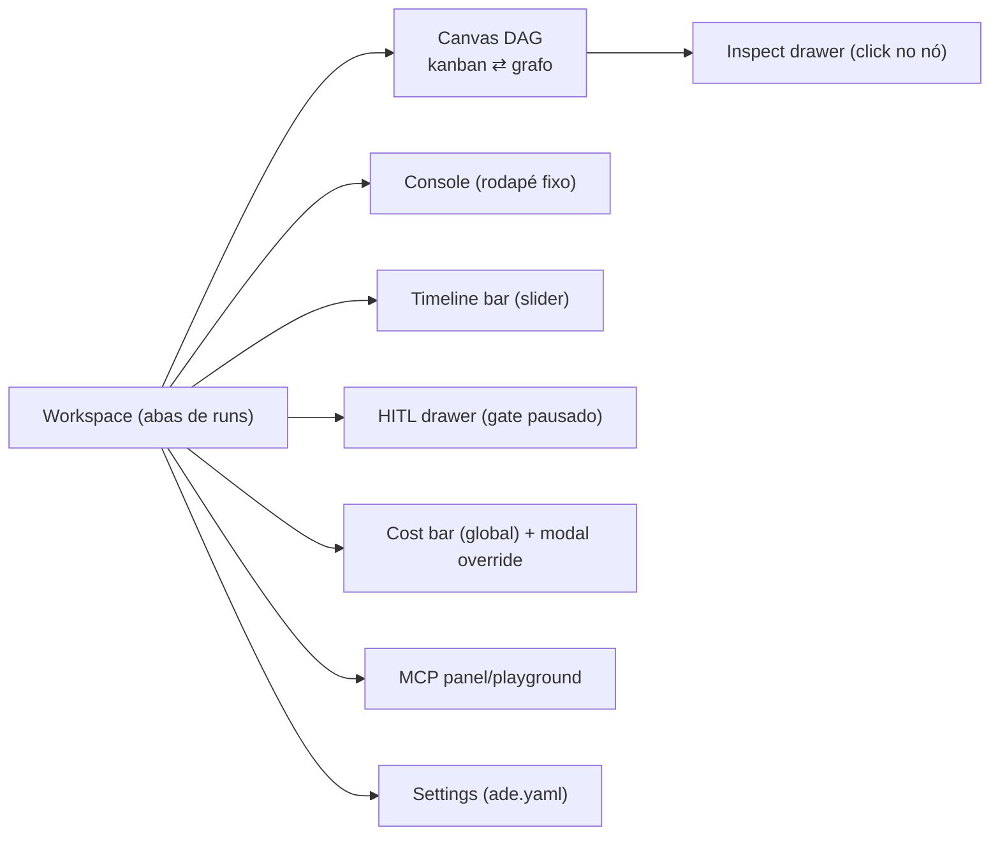

# 01 — Especificação funcional

Telas, casos de uso, fluxos e estados da UI do MVP. Decisões UX do BLUEPRINT
(UX1–UX20) mantidas salvo referência em contrário. UI em **inglês** (E8),
dark-only (E15), a11y AA básica + teclado (UX20).

## 1. Mapa de telas

Layout: 3 colunas redimensionáveis (UX14) — canvas central, console embaixo
(split, UX1), painéis laterais como **drawers não-modais** (UX8). F11 =
fullscreen do canvas (UX14). Persistência de layout = sessão apenas (UX15).

## 2. Casos de uso

### UC-01 — Criar e enfileirar run
**Ator**: operador. **Tela**: Workspace › New Run.
1. Form: `idea` (textarea), `stack` (select: python/java/rust/go/js — M-20),
   `routing_mode` (select, default `full`), `mock_llm` (toggle).
2. `POST /api/v1/runs` → run `queued`; se já houver `max_concurrent_runs`
   ativas (default 2), entra na **fila** (E3) com posição visível na aba.
3. Aba criada com status ao vivo. **Pós-condição**: run aparece no console via
   `run_created` + backfill.

### UC-02 — Observar execução ao vivo
Canvas mostra os nós de execução na ordem do pipeline (entry [âncora visual],
CPO, PM, Tech Lead, Test Writer, Developer, QA, Parallel Audit [expandível:
AppSec+DevOps, UX3]) — conjunto canônico em `03-contratos-api.md` §7: ids de
execução são os do backend; `entry`/`retry` são nós **virtuais de apresentação**
e `lessons` é artefato do Parallel Audit (visível no inspect drawer), nunca nó.
A cada `node_execution`: nó muda de estado com animação sóbria; `attempt_count`
vira badge `×N` (E7). Console acumula entradas filtráveis por nó/severidade/texto
(E6). Sem tokens voando (UX4).

### UC-03 — Reconexão sem perda (E14)
WS cai → banner "Server disconnected — reconnecting…" (não modal). Ao
reconectar: `GET events?after_seq=<último>` → aplica em ordem → retoma live.
Estado da tela preservado (Zustand). Indistinguível de uma sessão contínua.

### UC-04 — Inspecionar nó (payload, logs, custo, retries)
Click no nó → **Inspect drawer** (direita, não-modal): inputs/outputs do estado
(quando via checkpoint), logs do nó (journal, `log_excerpt`), tokens/custo
(`GET /runs/{id}/cost` › `nodes`), lista de tentativas com erro de cada uma.
Parallel Audit expande em sub-cards AppSec/DevOps (UX3).

### UC-05 — Time-travel (inspeção)
Timeline bar lista checkpoints reais da run (`thread_id` da coluna — M-02).
Arrastar o slider: nós futuros ficam "ghost" (opacity-40) + banner fixo
"Inspection — step X/Y — [Back to live]" (UX5/6). Inspect drawer mostra o
estado **daquele checkpoint**. Modo inspeção é read-only; qualquer ação de
controle exige "Back to live" ou fork (UC-07).

### UC-06 — Decidir num gate HITL
Run pausa em gate (developer/qa/parallel_audit) → status `waiting_decision`,
evento `hitl_gate_reached` → HITL drawer abre (não bloqueia o canvas, UX8).
Ações: **Approve** / **Retry** / **Adjust prompt** (categoria+mensagem) /
**Adjust state** (form guiado com diff de estado + JSON avançado validado, UX9 —
M-12) / **Abort**. Timeout (`hitl.timeout_seconds`, default 300s): com
`on_timeout=continue` (default, ADR-0006/M-11) o pipeline segue e a decisão
tardia é aceita se chegar; com `pause`, fica aguardando; com `abort`, run falha
com motivo `hitl_timeout_abort`. Histórico completo no drawer (quem/
quando/ação/estado — audit trail).

### UC-07 — Forkar a partir de um checkpoint
No modo inspeção: botão **"Fork from here"** → `POST /api/v1/trajectories/{thread_id}/fork`
(fork do checkpoint head da thread) → nova run (aba nova) com badge "fork of
#origem" (UX7), `parent_run_id` preenchido. A filha é enfileirada normalmente.
Original intocada (D4).

### UC-08 — Budget: warning e hard-stop
Cost bar global sempre visível (UX12): `$gasto / $budget`. 80% → toast +
barra âmbar. 100% → run pausa (`paused`) + **modal bloqueante**:
gasto detalhado por nó (chips, custos estimados marcados "~") + campo
`new_max_usd` + "Give override" (M-10 — `POST /api/v1/runs/{run_id}/cost/override`)
ou "Abort run". Override registra em `human_decisions` e resume a run.

### UC-09 — Gerir MCP
Painel lista servers do `ade.yaml` (status up/down) e tools de cada um.
Playground: escolher tool → form JSON dos args → **Run** (executa via
`POST /api/v1/mcp/servers/{name}/tools/{tool}`). Tool fora da allowlist
→ erro 403 exibido inline (deny-by-default); server indisponível → 503.

### UC-10 — Editar config (Settings)
Settings mostra `ade.yaml` efetivo: budget, `hitl.timeout_seconds` +
`on_timeout`, providers, servers MCP (habilitar/desabilitar). Salvar →
`PATCH /api/v1/config` (validado; 422 mostra o erro de campo). Sem editor de
YAML no V1 — form guiado apenas.

### UC-11 — Demo mock (UX16)
"Try demo" → run sintética local (zero custo, sem backend): percorre os nós de
execução + virtuais de apresentação (03 §7) com delays, demonstra gate HITL e
budget warning. Serve para onboarding e para
testes de UI offline. Badge "demo" na aba; não persiste.

### UC-12 — Export / import de trajetória
Menu da run: **Export** → download do envelope enriquecido (M-14). **Import**:
upload do envelope → nova run read-only (modo inspeção permanente, sem fork de
execução? — fork permitido: import cria thread real via M-13). Conflito de
thread → 409 com mensagem clara.

## 3. Estados da UI

### 3.1 Status de run (`Run.status`)

| status | significado | cor/badge |
|---|---|---|
| `queued` | criada (`POST /runs`) / na fila (E3) | neutro |
| `running` | executando | accent pulsando sóbrio |
| `waiting_decision` | pausada em gate HITL | warn |
| `decision_expired` | gate expirado; ainda aguardando (continue/pause) | warn + badge "timed out" |
| `paused` | hard-stop de budget (100%); aguardando override/abort | err |
| `completed` / `failed` / `aborted` | terminais | ok / err / neutro |

> `pending` e `budget_exceeded` permanecem no enum do backend (transição/
> legado); o estado observável de hard-stop é `paused` (M-10).

### 3.2 Status de nó

`pending` (neutro) → `running` (accent) → `approved|completed` (ok) /
`failed` (err) / `paused` (gate, warn) / `ghosted` (futuro no modo inspeção,
opacity-40). Badge `×N` de retries. Acento de cor por tipo de nó (UX19).

### 3.3 Estados globais

- **Offline**: banner + auto-reconnect (UC-03).
- **Inspeção**: banner fixo + controles de execução desabilitados.
- **Budget blocked**: modal (único modal bloqueante do sistema).
- **Empty**: workspace sem runs → EmptyState com CTA "New run" + "Try demo".
- **Erros de API**: toast com `detail` do backend; 401 → tela de "API key" 
  (campo para colar a key que `lf serve` imprime; persistida em sessionStorage).

## 4. Requisitos não-funcionais de UI

- A11y: contraste AA, navegação por teclado em abas/toggle/console (UX20),
  drawers com Esc-close e `aria-modal="false"`.
- Performance: console virtualizado a partir de ~500 entradas; canvas com 9 nós
  de execução (NodeRegistry) é trivial para React Flow; stores com undo/redo
  limitado a 50 passos.
- Sem router no V1; estado da URL não é fonte de verdade (abas = estado local).
