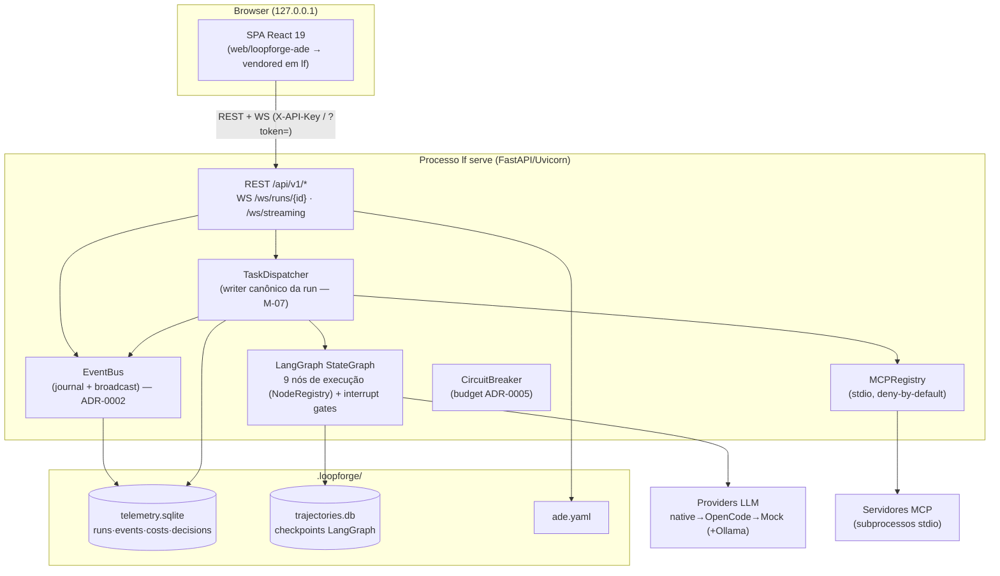
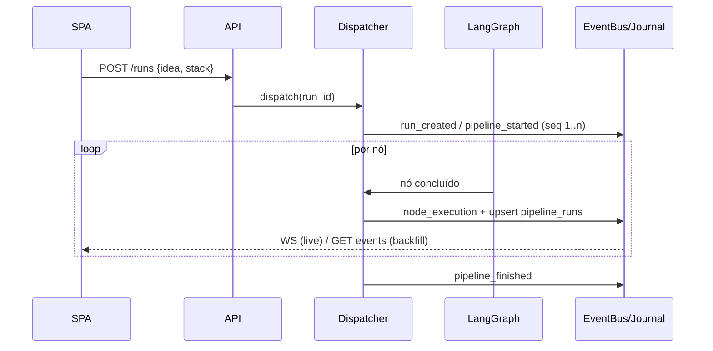

# 02 — Arquitetura técnica

## 1. Contexto de sistema



Decisões estruturais:
- **Backend embutido no `lf`** (E1) — a ADE é um modo de operação do engine, não
  um serviço separado. Um processo, um banco, um `ade.yaml`.
- **Pacote pip único** (ADR-0001) — SPA compilada servida por `StaticFiles` em
  `/app`; `lf serve` abre o browser na SPA.
- **Run = unidade primária, run↔thread 1:1 persistido** (E2, ADR-0003).
- **1 run ativa + fila** (E3) — sem execução paralela real no V1 (evita contenção
  de checkpoint/escrita; V2 traz checkout atômico de tarefas).

## 2. Camadas do backend (`src/lf/`)

| Camada | Módulos | Responsabilidade |
|---|---|---|
| HTTP/WS | `api/app.py`, `api/{runs em app, trajectories, mcp, providers, config}.py`, `api/websocket_manager.py`, `api/spa.py` (novo) | Contratos de `03-contratos-api.md`; mount da SPA |
| Eventos | `api/event_bus.py` (novo, M-05) | Persistir no journal + broadcast; único ponto de emissão |
| Orquestração | `orchestrator/task_dispatcher.py` | Dispatch/resume, gates HITL, upsert de run (M-07), enforcement de budget (M-08/10) |
| Pipeline | `pipeline/graph.py`, `pipeline/nodes/*`, `pipeline/llm_factory.py`, `pipeline/checkpointer.py` | DAG de 9 nós de execução (NodeRegistry), providers, checkpoints |
| MCP | `mcp/{client,registry,permissions,bridge}.py` | stdio, allowlist deny-by-default |
| Dados | `api/database.py`, `api/models.py`, `config/{schema,loader}.py` | SQLite async, schemas, `ade.yaml` |

Regras de dependência: API nunca chama LangGraph diretamente (passa pelo
dispatcher); dispatcher nunca escreve HTTP; nós do pipeline não conhecem a API;
`EventBus` é o único caminho de evento para fora do processo.

## 3. Arquitetura da SPA (`frontend/src/`)

Já implementada no branch `feature/ade-fase2` (T1–T11); ajustes de M-19:

```
app/            App.tsx, layout (3 colunas + fullscreen F11)
features/
  runs/         abas, fila, NewRunForm, demoMock (UX16)
  dag/          FlowCanvas (@xyflow/react), AgentNode, dagModel, InspectDrawer
  console/      ConsolePanel (filtros node/level/texto, autoscroll)
  timeline/     TimelineBar (slider + ghost + banner inspeção)
  hitl/         HitlDrawer (approve/retry/adjust_*/abort, audit trail)
  costs/        CostBar + modal override (dados reais pós M-08)
  mcp/          McpPlayground (lista tools; execução na Fase D)
shared/lib/     api.ts (REST), ws.ts (envelope v1, backoff), types.ts
shared/ui/      Button/Badge/Drawer/Banner/EmptyState/SplitPane
stores/         runsStore (undo/redo), canvasStore, consoleStore, wsStore, wsBridge
```

Padrões:
- **Server state** (runs, config, custo, checkpoints) → TanStack Query.
- **Live state** (status de nó, console, conexão) → Zustand alimentado pelo
  `wsBridge` (normalize envelope v1 → dispatch para stores).
- **Backfill**: ao abrir run → `GET events?after_seq=0` → aplica → conecta WS
  filtrado → dedup por `seq` (M-06). Reconexão usa `after_seq=último conhecido`.
- **Ids de nó canônicos = ids do backend** (`developer`, `tech_lead`,
  `parallel_audit`…); labels de exibição em `NODE_LABELS` (M-19) — elimina a
  camada de normalização de nomes que o branch precisou criar.
- Sem router no V1 (abas de runs substituem navegação por URL).

## 4. Fluxos-chave

### 4.1 Ciclo de vida de uma run



### 4.2 Gate HITL (com ADR-0006)

1. LangGraph interrompe após nó com gate → dispatcher publica `hitl_gate_reached`
   e status `waiting_decision`; UI abre o drawer (não-modal, UX8).
2. Operador decide via `POST /runs/{id}/decide` → API grava em
   `human_decisions` (com `run_id` = uuid da run) + publica
   `human_decision_submitted` → dispatcher consome via polling (~0,5 s) e aplica
   (`approve` continua; `retry` limpa erro; `adjust_prompt`/`adjust_state`
   atualizam estado; `abort` encerra).
   **Estado real (verificado no código)**: o polling existe
   (`_poll_remote_decision_once`, `task_dispatcher.py:242`, chamado no loop em
   `:465` a cada ~0,5 s), mas consulta `human_decisions WHERE run_id = <thread_id>`
   (`:336`) enquanto a API grava `run_id = <uuid da run>` — **as chaves nunca
   casam e a decisão remota nunca é consumida hoje**. `_check_remote_decision`
   (`:272`) é código morto. O fix é a task A9 / M-22 (dispatcher passa a consultar
   pelo uuid da run, extraído do `thread_id` no formato `run-{uuid}` do ADR-0003),
   com aceite E2E obrigatório.
3. Timeout: emite `human_decision_expired`; comportamento conforme
   `hitl.on_timeout` (`pause` = segue aguardando, default; `continue` = prossegue).

### 4.3 Time-travel e fork

- **Inspeção**: timeline lista checkpoints (`GET .../checkpoints`); slider
  seleciona → `GET .../checkpoints/{cid}` → UI entra em modo inspeção (ghost nos
  nós futuros + banner fixo, UX5/6). Read-only.
- **Fork** (M-13): `POST .../fork {checkpoint_id?}` → servidor copia tuples do
  checkpoint escolhido para `run-{novo_id}` → cria run filha (`parent_run_id`) →
  `fork_created` → aba nova na UI vinculada à origem (UX7). A run original é
  intocada (D4: time-travel = estado do grafo, sem rollback de filesystem).

## 4.4 Budget (ADR-0005)

`CostTracker.track(run_id, node, ...)` a cada chamada LLM → dispatcher soma
`llm_costs` da run → ≥80%: `budget_warning`; ≥100% (com buffer 10% em estimados):
status `budget_exceeded`, pausa, `budget_exceeded`; `budget-override` → resume.

## 5. Comunicação — resumo de escolhas

| Preocupação | Escolha | Por quê |
|---|---|---|
| Live updates | WS com envelope v1 + seq | Já existente; seq fecha gap de reconexão |
| Backfill | REST journal (`after_seq`) | Simples, testável, separado do lifecycle do socket |
| Token streaming | Fora do MVP | ADR-0007 |
| Estado do grafo | Checkpoints LangGraph (read-only) + `aupdate_state` em HITL | Não reinventar persistência |
| Server state na UI | TanStack Query | Cache/poll declarativo |
| Live state na UI | Zustand + wsBridge | Já implementado; undo/redo |

## 6. Não-objetivos arquiteturais (V2+)

Execução paralela real com checkout atômico; worktrees isolados por lane; RBAC;
evals; token streaming; MCP sobre HTTP/SSE; prune/TTL; tema claro/i18n.
