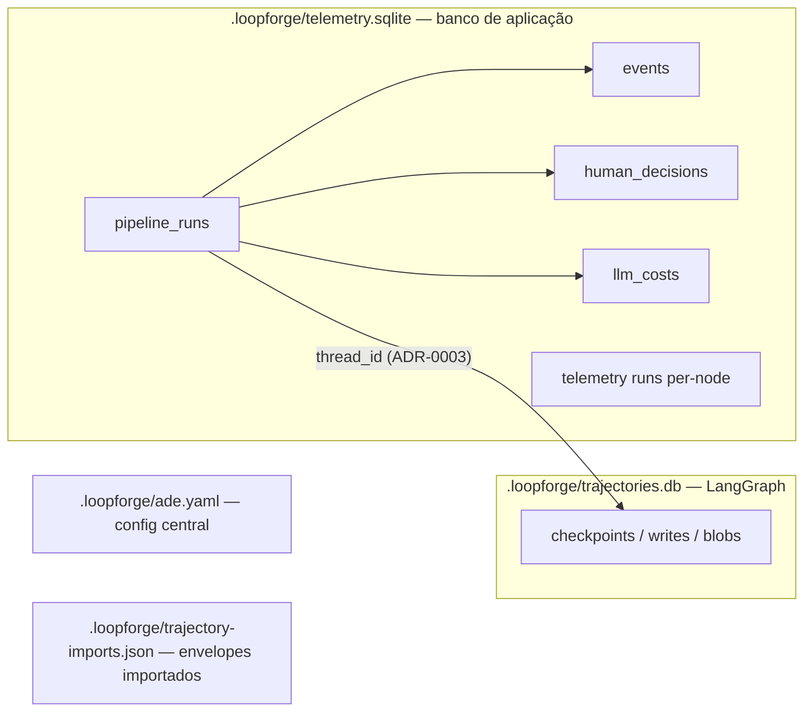

# 04 — Modelo de dados e persistência

Tudo em `.loopforge/` (diretório de runtime do engine). Dois bancos SQLite
separados **de propósito**: o schema de checkpoints pertence ao LangGraph (pode
mudar entre versões da lib); o schema de aplicação pertence à ADE.

## 1. Visão geral



- `telemetry.sqlite` — SQLAlchemy async + aiosqlite, WAL + `busy_timeout`
  (já existente). Nome do arquivo **mantido** (renomear para `ade.db` não agrega).
- `trajectories.db` — `AsyncSqliteSaver` (Fase 1), WAL explícito.
- `checkpoints.sqlite` (69 MB) — **órfão legado**, sem referência no código;
  descartável (M-17).
- Migrações: aditivas, aplicadas no `init_db` com checagem de coluna
  (`PRAGMA table_info`) — padrão já usado no projeto; alembic segue disponível
  mas não introduzido no V1 (custo > benefício para 3 `ALTER TABLE`).

## 2. Tabelas de aplicação

### `pipeline_runs` (existente + M-02)

| coluna | tipo | nota |
|---|---|---|
| `id` | TEXT PK | uuid — chave pública (`run_id`) |
| `idea`, `stack`, `status`, `current_node`, `logs`, `duration_seconds`, `created_at`, `updated_at` | — | existentes |
| **`thread_id`** | TEXT UNIQUE | `run-{id}` (ADR-0003); backfill `'run-' \|\| id` |
| **`parent_run_id`** | TEXT NULL→`pipeline_runs.id` | forks (M-13) |

Escrita: **dispatcher** é o escritor canônico (upsert no dispatch e a cada
transição de nó — M-07), cobrindo runs CLI e API.

### `events` — event journal (novo, ADR-0002/M-05)

| coluna | tipo | nota |
|---|---|---|
| `id` | INTEGER PK | |
| `run_id` | TEXT NOT NULL | FK lógica → `pipeline_runs.id` |
| `thread_id` | TEXT | redundância para debug |
| `seq` | INTEGER NOT NULL | monotônico por run, 1-based; `UNIQUE(run_id, seq)` |
| `event` | TEXT | ver catálogo em `03-contratos-api.md` §7 |
| `payload` | TEXT (JSON) | |
| `ts` | TEXT | ISO-8601 UTC |

Índice `(run_id, seq)`. Sem prune no V1 (E11) — tabela cresce dezenas de linhas
por run; export/import de trajectories é o backup manual.

### `llm_costs` (existente + M-08/M-09)

| coluna | tipo | nota |
|---|---|---|
| `id`, `model`, `prompt_tokens`, `completion_tokens`, `cost_usd`, `created_at` | — | existentes |
| **`run_id`** | TEXT | contexto da chamada |
| **`node`** | TEXT | nó do DAG que originou a chamada (chips UX12) |
| **`estimated`** | INTEGER 0/1 | 1 = estimativa (subprocess OpenCode sem usage real) |

### `human_decisions` (existente)

`id, run_id, gate_node, action, feedback_category, feedback_message, user, created_at`
+ coluna **`state_patch` TEXT NULL** (M-12) para auditoria de `adjust_state`.
Registra também `budget-override` (M-10) como ação.

### `telemetry runs` (per-node, existente)

Mantida para analytics; **não** é fonte de custo da UI (a fonte é `llm_costs`
agregado — M-08). Estimativas `duration*450` tokens do `analytics.py` são
reconhecidas como heurística e não entram no hard-stop.

## 3. Checkpoints (LangGraph, `trajectories.db`)

- Tabelas `langgraph_checkpoints`, `langgraph_checkpoint_writes`, `..._blobs`
  criadas pelo saver. Schema **de propriedade da biblioteca** — pin de versão
  (`langgraph-checkpoint-sqlite==3.1.0`) + teste de fumaça de upgrade (risco R-03).
- `thread_id = run-{run_id}`; conteúdo = `channel_values` (todo o `GraphState`:
  artefatos, contadores, feedback, snapshot do circuit breaker) + metadata
  (`ts`, `step`, `source`).
- Leitura arbitrária por `checkpoint_id` (time-travel) já funciona
  (`api/trajectories.py:77-79`). Fork copia tuples para a nova thread (M-13).

## 4. Configuração (`.loopforge/ade.yaml`)

```yaml
budget:        { max_usd: 10.0 }            # fonte única (ADR-0005)
hitl:          { timeout_seconds: 300, on_timeout: pause }   # ADR-0006 (on_timeout: novo)
providers:     { primary: native, ollama_base_url: "http://localhost:11434" }
mcp_servers:
  - { name: fs, command: "…", args: ["…"], tools_allowlist: ["read_file"], enabled: true }
```

- Lido por `load_ade_config()` (Pydantic); escrito via `PATCH /api/v1/config`
  (validado + escrita atômica). Sem variáveis de ambiente próprias (env só cobre
  `LF_API_*`); `LF_SPA_DIST` aponta para build da SPA (ADR-0001).
- Arquivo versionável pelo usuário; defaults seguros sem o arquivo.

## 5. Importados (`trajectory-imports.json`)

Envelopes importados (Fase 1) — append-only, formato `schema_version: "1.0"`.
V2 candidato: migrar para tabela; V1 mantém arquivo (volume ínfimo).

## 6. Retenção e tamanho

- Sem TTL/prune no V1 (E11). Ordens de grandeza: checkpoints dominam
  (~centenas de KB por run); `events` e `llm_costs` são KB por run.
- Rota de descarte manual: `DELETE /api/v1/runs/{id}` remove a run e seus
  eventos/custos; checkpoints permanecem (órfãos recuperáveis via trajectories
  API) — política de prune conjunta é V2.
