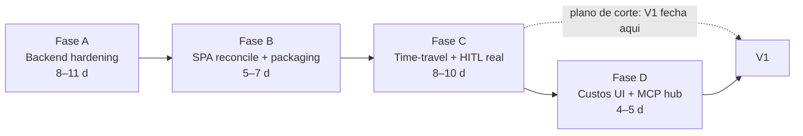

# 06 — Plano de implementação

> **Status 2026-08-13: Fases A–D COMPLETAS** (backend + SPA + docs) + pós-MVP.
> Este arquivo é o plano histórico; rastreabilidade de execução e estado atual
> em `STATUS-IMPLEMENTACAO.md`.

Ponto de partida real (auditado em 2026-08-07): **Fase 1 do plano antigo está
implementada** no engine; **SPA T1–T11 commitadas** no branch `feature/ade-fase2`
(não mergeado); T12–T16 pendentes. Este plano **substitui** o Gantt de 4 fases do
BLUEPRINT. Estimativas em **dias de trabalho focado** (dev solo: multiplicar por
~1,5–2× em calendário).

## Visão geral

Dependências: A → B (SPA precisa do envelope v1); B → C (fork/adjust_state usam
a UI mergeada); C → D (cost UI consome `/cost` da Fase A; MCP exec consome
contratos estáveis). **Plano B de corte**: se a banda apertar, V1 fecha no fim
da Fase C e a Fase D vira V1.1 — sem perda de coerência (custos já têm
hard-stop no backend; MCP já é listável).

## Fase A — Backend hardening e fundação de eventos (engine)

Repo: `agentes/LoopForge`, branch `feature/ade-fase-a`.

| Task | Conteúdo | M-ids |
|---|---|---|
| A1 | Colunas `thread_id`/`parent_run_id` + migração aditiva; thread `run-{id}` no dispatch; fix `resume` | M-01, M-02 |
| A2 | Dispatcher writer canônico (upsert `PipelineRun` no dispatch e por nó; cobre CLI) | M-07 |
| A3 | `EventBus` + tabela `events` + envelope v1; migrar `_broadcast_ws` e broadcasts inline | M-05 |
| A4 | WS filtrado por run + `GET /runs/{id}/events` backfill | M-06 |
| A5 | Auth nos 4 routers v1; `/api/v1/runs*` canônico + alias legado com `Sunset`; CORS `LF_CORS_ORIGINS` | M-03, M-04, M-18 |
| A6 | Budget fonte única (`ade.yaml`→CircuitBreaker); `llm_costs` +`run_id,node,estimated`; `/runs/{id}/cost`; custo estimado subprocess; hard-stop pausa + `POST /runs/{id}/cost/override` (override de budget) | M-08, M-09, M-10 |
| A7 | Cleanup: TS morto em `src/`, `AGENTS.md`, nota mypy, doc `checkpoints.sqlite` legado | M-17 |
| A8 | **Fila de execução (E3)**: hoje todo `POST /runs` dispara `asyncio.create_task` concorrente (`app.py:165-175`) — paralelismo não intencional. Implementar fila com `runner.max_concurrent_runs` (default 2): run nova vira `queued` quando já há `max_concurrent_runs` ativas; worker promove a próxima `queued` ao término (eventos `run_updated` alimentam as abas/fila da UI) | M-21 |
| A9 | **Fix HITL remoto (bug ativo)**: `POST /decide` grava `human_decisions.run_id = uuid`, mas o dispatcher polla com `run_id = thread_id` (`task_dispatcher.py:336`) — nunca casa. Dispatcher passa a consultar pelo uuid extraído do `thread_id` (`run-{uuid}`, ADR-0003); remover código morto `_check_remote_decision` (`:272`) | M-22 |

**Aceite**: `pytest` verde com cobertura ≥75%; teste de contrato novo
(`test_event_envelope.py`: todo evento WS casa com envelope v1 + persiste no
journal); resume E2E via API funciona (`mock_llm`); run `lf run --mock` aparece
na lista da API com eventos journados; 401 em rota v1 sem key; estouro de
budget pausa run e override a resume (teste); **`budget_warning` (80%) emitido
com payload correto (teste)**; **E2E HITL sem stdin: `POST /decide` é consumido
pelo dispatcher no gate e a run prossegue (A9)**; **fila: 2º `POST /runs` fica
`queued` até o 1º terminar, e entra em `running` sem intervenção (A8)**;
**teste de migração/backfill sobre DB real** (fixture com `telemetry.sqlite` e
`trajectories.db` de uma run 6.0.0: migração aditiva aplica colunas via
`PRAGMA table_info`, backfill `thread_id = 'run-'||id` correto, journal íntegro).

## Fase B — Reconcile da SPA + packaging (repo ADE + mount no engine)

Repo: `web/loopforge-ade` (merge `feature/ade-fase2` → `main` com ajustes) +
`agentes/LoopForge` (mount). **Referência visual obrigatória de B1–B6 e do QA
visual: `docs/01b-design-system.md`** (tokens, componentes, motion, microcopy).

| Task | Conteúdo | M-ids |
|---|---|---|
| B1 | Merge do branch; `normalizeWsEvent` → envelope v1 (dedup por `seq`, backfill-then-live); ids de nó = ids backend | M-19 |
| B2 | `NewRunForm` com `stack` + `routing_mode`; telas de erro 401 (API key) | M-20 |
| B3 | CostBar consumindo `/runs/{id}/cost` (poll a cada `node_execution`); modal override chama `budget-override` | M-08, M-10 |
| B4 | `spa.py` no engine: `resolve_spa_dist()` + mount `/app`; fix token WS do dashboard legado + banner "deprecated" | M-16 |
| B5 | Pacote único: `sync-dist` script, `lf.ade.static` package-data, `pyproject.toml` do repo ADE **mantido como placeholder** do pacote `loopforge-ade` (M-15); **criar** job de CI de drift SPA×static (hoje **não existe** — o engine só tem workflows Python: ruff/mypy/pytest) e **automatizar o smoke de instalação limpa** (CI: `pip install .` em venv limpo + `lf serve` + `GET /health` + `GET /app`) | M-15 |
| B6 | QA: `npm run build && lint && test`, smoke Playwright (load, DAG com conjunto canônico de nós — 03 §7, abas, console, drawer), suíte backend | E13 |

**Aceite**: `lf serve` serve a SPA em `/app` a partir do pacote instalado
(`pip install .` em venv limpo); SPA opera uma run mock de ponta a ponta;
reconexão forçada (kill no WS) não perde eventos; nenhum `.gitkeep` restante em
`costs/` (MCP playground segue read-only até D — documentado na UI).

## Fase C — Time-travel e HITL reais (8–10 d)

Estimativa revista após auditoria: o fork real manipula checkpoint tuples do
LangGraph (schema de terceiros, pinado em `langgraph-checkpoint-sqlite==3.1.0`) e
o roundtrip export→import exige testes de fidelidade estado-a-estado — 5–6 d era
otimista.

| Task | Conteúdo | M-ids |
|---|---|---|
| C1 | Fork real: copiar checkpoint tuples → nova thread; run filha com `parent_run_id`; evento `fork_created`; UI "Fork from here" | M-13 |
| C2 | Export enriquecido (steps por nó + events do journal + custos); import valida e materializa thread | M-14 |
| C3 | `adjust_state`: `state_patch` validado + `aupdate_state`; UI: form guiado com diff + JSON avançado | M-12 |
| C4 | `hitl.on_timeout` `Literal["continue","abort","pause"]` (default `continue` — M-11); dispatcher re-aguarda em `pause`; evento `hitl_gate_reached`; banner/badge na UI | M-11 |
| C5 | Timeline endereçada por `run_id` (coluna `thread_id`); checkpoints com metadata de nó | M-02 |

**Aceite**: forkar do checkpoint pós-Tech Lead gera run filha executável e
original intacta; export → import → inspeção idêntica; `adjust_state` altera
estado e a run continua com ele; com `on_timeout=pause`, gate expirado não
consome LLM e aceita decisão tardia.

## Fase D — Custos na UI + MCP hub

| Task | Conteúdo | M-ids |
|---|---|---|
| D1 | Chips de custo por nó (UC-04) + indicador de estimado `~` | M-08 |
| D2 | `POST /mcp/servers/{name}/tools/{tool}` (execução via allowlist); playground funcional | Fase D de MCP |
| D3 | Settings UI (budget, hitl, providers, toggle de servers MCP) via `PATCH /config` | E9 |
| D4 | Endurecimento final: testes E2E dos fluxos UC-01..UC-12; docs de operação revisadas | — |

**Aceite**: checklist de governança (`05`) verde; UCs 1–12 executáveis;
`docs/08-operacao.md` seguido por alguém sem contexto resulta em ambiente rodando.

## Resumo de estimativas

| Fase | Dias focados | Calendário solo (est.) |
|---|---|---|
| A | 8–11 | ~2,5–3 semanas |
| B | 5–7 | ~2 semanas |
| C | 8–10 | ~2–2,5 semanas |
| D | 4–5 | ~1,5 semana |
| **Total** | **25–33** | **~7–10 semanas** |

Comparação honesta com o BLUEPRINT (31 dias úteis / 4–6 semanas): este plano é
maior porque inclui o que a auditoria achou (journal, fix de identidade
run↔thread, **fix do HITL remoto e fila E3 — à época inexistentes/quebrados**,
budget real, fork real) — trabalho que o plano antigo empurrava para "gaps
documentados". Ambos os fixes e a fila foram **entregues na Fase A** (M-22, M-21).

## Rastreabilidade

Cada task referencia M-ids (`09-mudancas-sobre-o-existente.md`) e ADRs
(`adr/`). Commits devem citar o M-id (ex.: `fix(api): resume usa thread_id
persistido [M-01]`).
